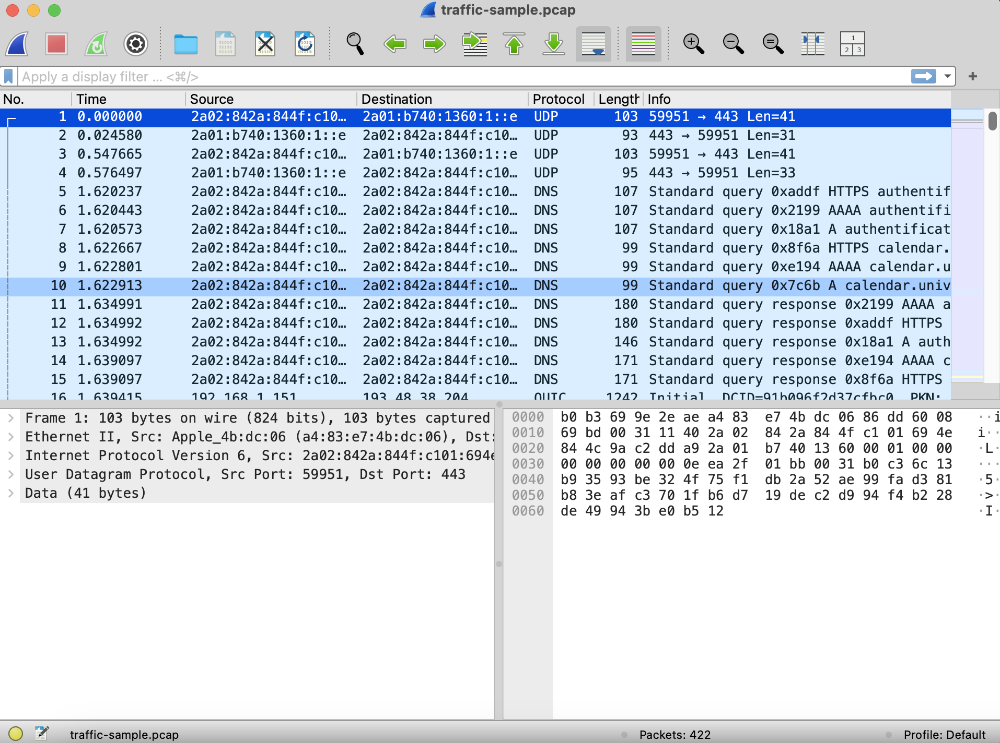
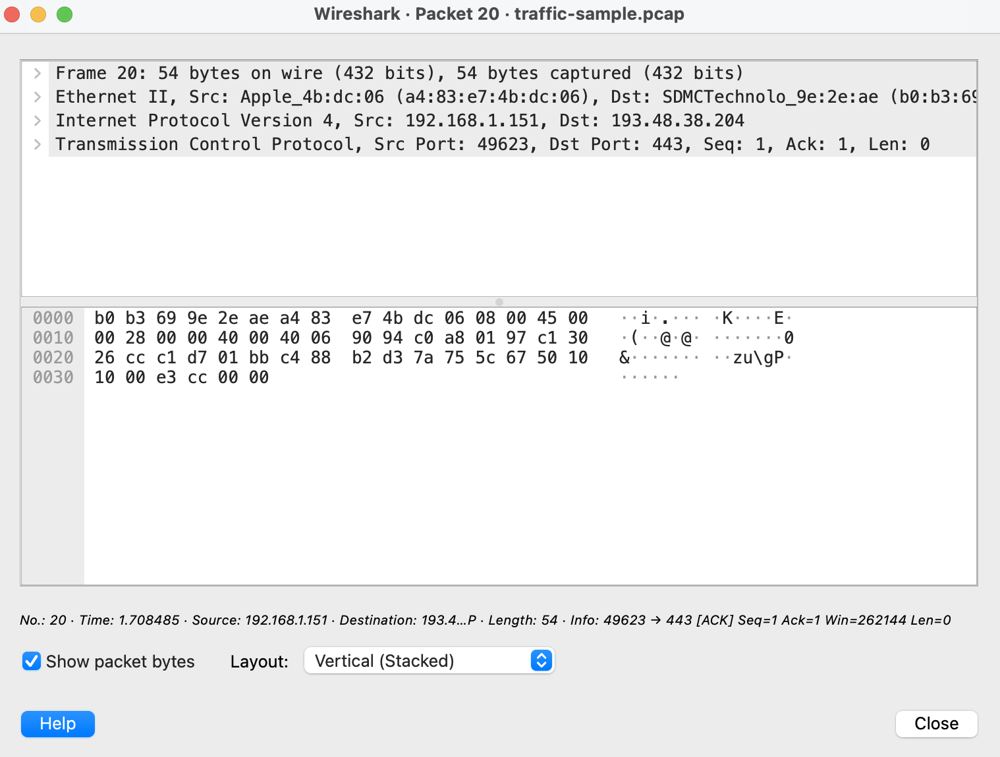

# Analyse du Trafic Réseau avec Wireshark

## Objectif : 

Ce projet vise à capturer et analyser des paquets réseau pour comprendre les protocoles courants (HTTP, DNS, TCP) et rechercher d’éventuels signes de trafic suspect ou malveillant. De plus, des mesures sont mises en place pour anonymiser les adresses IP afin de protéger les données sensibles.

## Étapes Détaillées : 
1. Installation de Wireshark : 
- nstalle Wireshark sur macOS : 
Utilise Homebrew pour l'installation :

```bash
brew install --cask wireshark 
```
Autorise les privilèges pour capturer les paquets sans être administrateur.

-Lance Wireshark et sélectionne ton interface réseau Wi-Fi pour capturer le trafic.

2. Capturer le trafic réseau : 

- Ouvre Wireshark.
- Sélectionne ton interface réseau active (Wi-Fi).
- Clique sur Start pour démarrer la capture.
- Utilise un navigateur ou une application pour générer du trafic (par exemple, visite un site Web).
- Arrête la capture en cliquant sur Stop.
- Enregistre la capture au format .pcapng sous le nom traffic-sample.pcapng.


3. Analyse des protocoles courants : 

#### Filtrer les protocoles :

- HTTP : Tape http dans la barre de filtre pour afficher uniquement le trafic HTTP.
- DNS : Tape dns pour afficher les requêtes DNS.
- TCP : Tape tcp pour observer les paquets TCP.

#### Identifier des éléments clés :

- Adresses IP source et destination.
- Ports utilisés (par exemple, port 80 pour HTTP, port 53 pour DNS).
- Détails sur les requêtes et réponses.


4. Informations sur les données affichées dans Wireshark

1. Colonnes principales dans l'interface Wireshark :

- No. (Numéro) : Numéro unique attribué à chaque paquet capturé.
- Time (Temps) : Temps écoulé depuis le début de la capture (ou l’horodatage exact si configuré).
- Source : Adresse IP ou MAC de l’expéditeur du paquet.
- Destination : Adresse IP ou MAC du destinataire du paquet.
- Protocol : Protocole utilisé (HTTP, DNS, TCP, UDP, ARP, etc.).
- Length : Taille du paquet en octets.
- Info : Informations supplémentaires spécifiques au protocole (URL pour HTTP, noms de domaine pour DNS, etc.).




2. Détails des paquets individuels :

#### Quand tu cliques sur un paquet, tu peux voir des informations plus détaillées :

- Frame : Informations sur la taille, l'interface réseau, etc.
- Ethernet : Adresse MAC source et destination.
- IP : Adresses IP source et destination, TTL (Time to Live), protocole transporté.
- Transport Layer (TCP/UDP) : Ports source et destination, flags TCP (SYN, ACK, FIN, etc.).
- Application Layer : Contenu spécifique au protocole (requêtes HTTP, résolutions DNS, etc.).

3. Filtres pour mieux comprendre les données :

#### Filtrer par protocole :

- http : Pour voir uniquement les paquets HTTP.
- dns : Pour voir les résolutions de noms de domaine.

#### Filtrer par IP :

- ip.addr == 192.168.1.1 : Voir uniquement les paquets liés à cette IP.
- Filtrer les erreurs ou anomalies :
- tcp.flags == 0x02 : Voir toutes les connexions initiales TCP (SYN).
- http.response.code >= 400 : Voir les erreurs HTTP (codes 4xx ou 5xx).




4. Trafic courant sur une interface Wi-Fi :

- Requêtes DNS : Résolutions de noms de domaine comme "google.com" ou "example.com".

- Paquets HTTP/HTTPS : Trafic web (les connexions HTTPS sont chiffrées, donc seul l’en-tête est visible).

- ARP : Protocoles pour résoudre les adresses MAC (communication entre appareils sur le réseau local).

- DHCP : Attribution des adresses IP par ton routeur.

- TCP/UDP : Connexions transportant des données entre différents appareils.


5. Anonymisation des adresses IP : 

Pour protéger les adresses IP sensibles dans les fichiers .pcap, on utilise tcprewrite.

##### Installation de tcprewrite

- Installe tcprewrite via Homebrew :
```bash
brew install tcpreplay
```

- Conversion du fichier .pcapng en .pcap

Si ton fichier est au format .pcapng, convertis-le en .pcap :
- Ouvre le fichier dans Wireshark.
- Va dans File > Export Specified Packets.
- Sauvegarde-le au format .pcap sous le nom traffic-sample.pcap.
- Anonymiser les adresses IP
- Exécute la commande suivante pour anonymiser les adresses IP source et destination :

```bash
tcprewrite --infile=traffic-sample.pcap --outfile=traffic-sample-anonymized.pcap \
--dstipmap=0.0.0.0/0:192.168.0.0/24 \
--srcipmap=0.0.0.0/0:10.0.0.0/24
```

- --infile : Le fichier d'entrée.
- --outfile : Le fichier anonymisé en sortie.
- --dstipmap : Remplace les adresses IP de destination par une plage privée.
- --srcipmap : Remplace les adresses IP source par une plage privée.
- Ouvre le fichier anonymisé dans Wireshark pour vérifier que les IP ont été modifiées.

6. Floutage des adresses IP dans les captures d’écran

1. Prends une capture d’écran de l’interface Wireshark (Cmd + Shift + 4 sur macOS).
2.  Floute ou masque les adresses IP avec des outils comme :
- Aperçu (macOS) :
- Ouvre l’image avec l’application Aperçu.
- Utilise l’outil Annoter pour dessiner un rectangle opaque sur les adresses IP sensibles.
- GIMP : Utilise l’outil de floutage.

